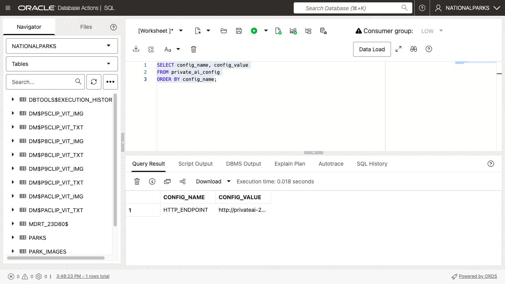
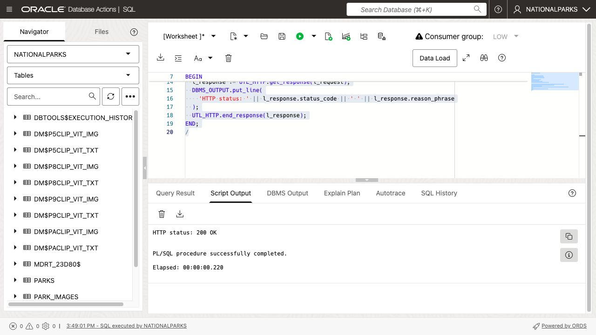
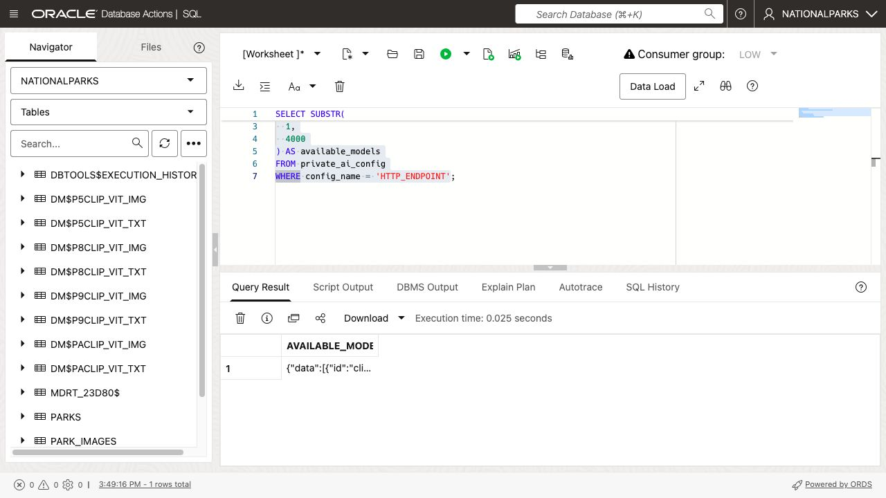
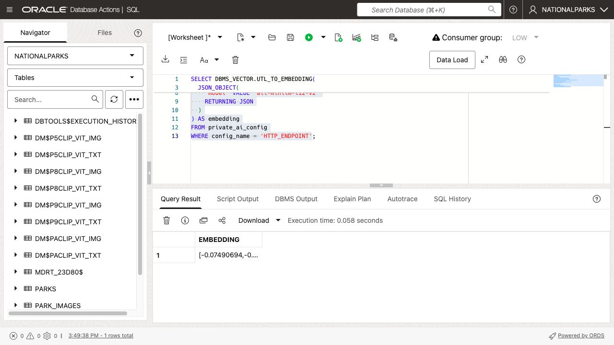
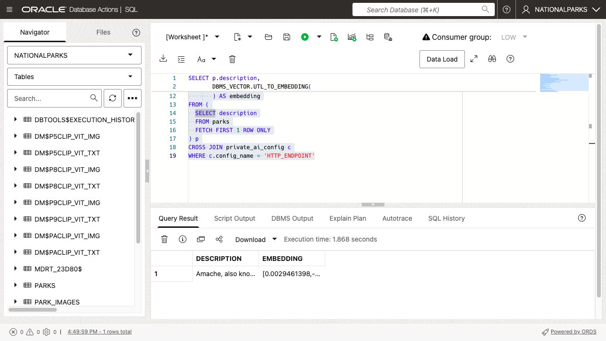
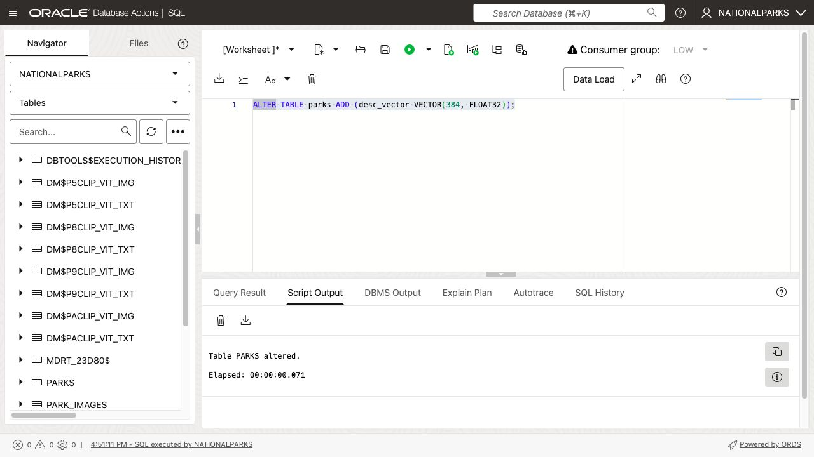
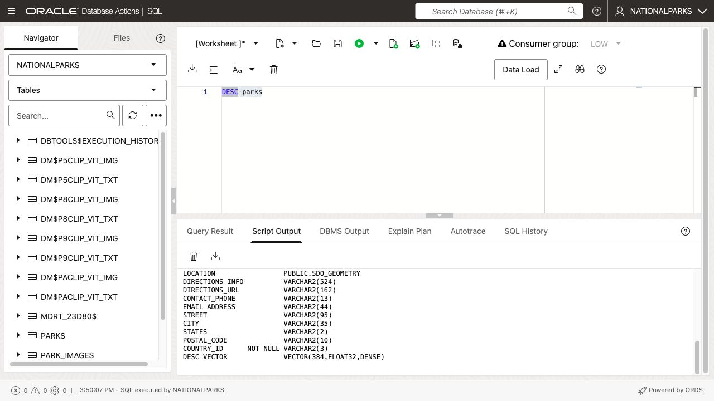
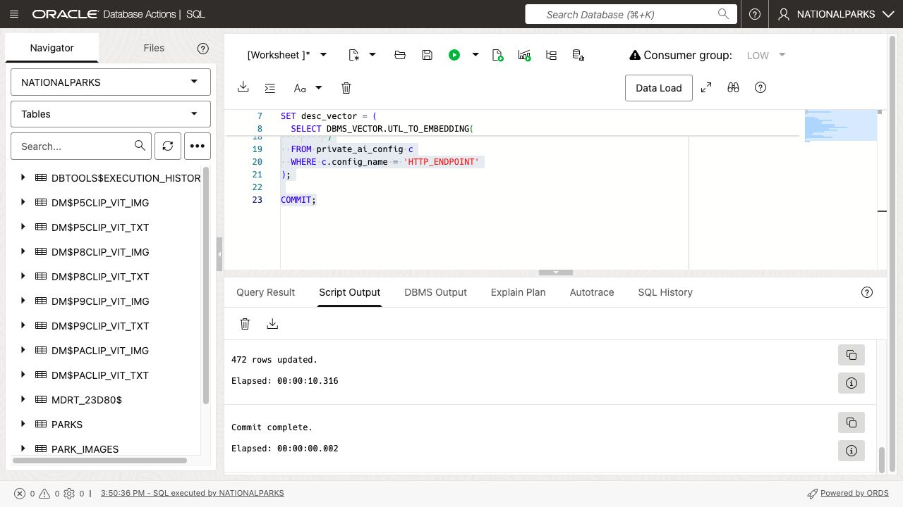
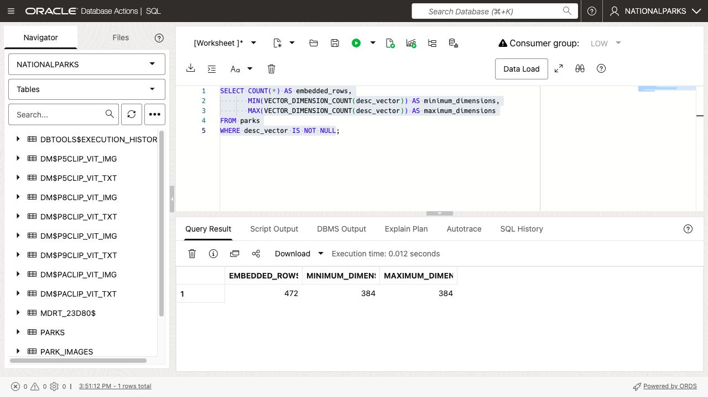

# Generate Vector Embeddings with Private AI Services Container

## Introduction

This lab generates vector embeddings with Oracle Private AI Services Container and stores them in Oracle Autonomous AI Database Serverless. The embedding model runs on a separate Compute instance, while the database stores, indexes, and searches the resulting vectors alongside relational data.

This architecture separates model inference from database processing. It also allows an organization to use container-hosted models without sending source data to a public AI endpoint. The workshop uses HTTP on a private network for simplicity. Production deployments should use HTTPS.

The container includes `all-minilm-l12-v2`, a sentence-transformer model that produces 384-dimensional text vectors. Later labs use the container's CLIP text and image models, which produce compatible 512-dimensional vectors for multimodal image search.

Estimated Time: 20 minutes

### Objectives

In this lab, you will:

* Verify the Private AI endpoint supplied by Terraform
* Verify the container health and inspect its available models
* Generate text embeddings with `DBMS_VECTOR.UTL_TO_EMBEDDING`
* Add a vector column to the `PARKS` table
* Populate the vector column with container-generated embeddings

### Prerequisites

This lab assumes you have:

* Access to the workshop's Database Actions SQL Worksheet
* All previous labs successfully completed

## Task 1: Verify the Private AI endpoint

Terraform created the Compute instance, started the container, configured the database network ACL, and stored the container's private HTTP endpoint in `PRIVATE_AI_CONFIG`. Every lab reuses this configuration.

1. Display the endpoint prepared for your reservation.

    ```sql
    <copy>
    SELECT config_name, config_value
    FROM private_ai_config;
    </copy>
    ```

    The value begins with `http://`, uses the reservation-specific private DNS name, and ends with port `8080`. Do not add `/health` or `/v1/embeddings` when copying the base endpoint into other examples.

    

2. Verify that the container is healthy. A successful request prints `HTTP status: 200 OK`.

    ```sql
    <copy>
    SET SERVEROUTPUT ON

    DECLARE
      l_request  UTL_HTTP.req;
      l_response UTL_HTTP.resp;
      l_endpoint VARCHAR2(1000);
    BEGIN
      SELECT config_value
      INTO l_endpoint
      FROM private_ai_config
      WHERE config_name = 'HTTP_ENDPOINT';

      l_request := UTL_HTTP.begin_request(l_endpoint || '/health', 'GET');
      l_response := UTL_HTTP.get_response(l_request);
      DBMS_OUTPUT.put_line(
        'HTTP status: ' || l_response.status_code || ' ' || l_response.reason_phrase
      );
      UTL_HTTP.end_response(l_response);
    END;
    /
    </copy>
    ```

    

3. Display the models loaded in the container.

    ```sql
    <copy>
    SELECT SUBSTR(
      UTL_HTTP.request(config_value || '/v1/models'),
      1,
      4000
    ) AS available_models
    FROM private_ai_config
    WHERE config_name = 'HTTP_ENDPOINT';
    </copy>
    ```

    Confirm that the response includes these models:

    * `all-minilm-l12-v2` with `TEXT_EMBEDDINGS`
    * `clip-vit-base-patch32-txt` with `TEXT_EMBEDDINGS`
    * `clip-vit-base-patch32-img` with `IMAGE_EMBEDDINGS`
    * `Ministral-3-3B-Reasoning-2512-Q8_0` with `TEXT_GENERATION`

    The 26.2.1 container also exposes reranking and classification endpoints, but the workshop image does not include a model advertising those capabilities.

    

## Task 2: Generate and display text vectors

`DBMS_VECTOR.UTL_TO_EMBEDDING` accepts the source text and a JSON object describing the provider, endpoint, and model. The `credential_name` key must be present with a JSON `null` value for this unauthenticated HTTP configuration.

1. Generate a vector for the word `hello` with the container's `all-minilm-l12-v2` model.

    ```sql
    <copy>
    SELECT DBMS_VECTOR.UTL_TO_EMBEDDING(
      'hello',
      JSON_OBJECT(
        'provider' VALUE 'privateai',
        'credential_name' VALUE NULL,
        'url' VALUE config_value || '/v1/embeddings',
        'host' VALUE 'local',
        'model' VALUE 'all-minilm-l12-v2'
        RETURNING JSON
      )
    ) AS embedding
    FROM private_ai_config
    WHERE config_name = 'HTTP_ENDPOINT';
    </copy>
    ```

    The first call to a model can take longer because the container loads that model into memory. The returned vector contains 384 `FLOAT32` dimensions.

    

2. Generate an embedding for one park description.

    ```sql
    <copy>
    SELECT p.description,
           DBMS_VECTOR.UTL_TO_EMBEDDING(
             p.description,
             JSON_OBJECT(
               'provider' VALUE 'privateai',
               'credential_name' VALUE NULL,
               'url' VALUE c.config_value || '/v1/embeddings',
               'host' VALUE 'local',
               'model' VALUE 'all-minilm-l12-v2'
               RETURNING JSON
             )
           ) AS embedding
    FROM (
      SELECT description
      FROM parks
      FETCH FIRST 1 ROW ONLY
    ) p
    CROSS JOIN private_ai_config c
    WHERE c.config_name = 'HTTP_ENDPOINT';
    </copy>
    ```

    

## Task 3: Add the vector column

The database stores container-generated vectors in the same `VECTOR` data type used for vectors generated inside the database or by another provider.

1. Add a 384-dimensional vector column to the `PARKS` table.

    ```sql
    <copy>
    ALTER TABLE parks ADD (desc_vector VECTOR(384, FLOAT32));
    </copy>
    ```

    

2. Describe the table and inspect the new column.

    ```sql
    <copy>
    DESC parks
    </copy>
    ```

    

## Task 4: Populate and verify the vectors

The `PARKS` table contains 472 rows. Each row makes one private embedding request and stores the returned vector. This is intentionally simple for the workshop; production bulk-loading workflows can use batching and parallel processing.

1. Generate and store an embedding for every park description.

    ```sql
    <copy>
    BEGIN
      UTL_HTTP.set_transfer_timeout(120);
    END;
    /

    UPDATE parks p
    SET desc_vector = (
      SELECT DBMS_VECTOR.UTL_TO_EMBEDDING(
               p.description,
               JSON_OBJECT(
                 'provider' VALUE 'privateai',
                 'credential_name' VALUE NULL,
                 'url' VALUE c.config_value || '/v1/embeddings',
                 'host' VALUE 'local',
                 'model' VALUE 'all-minilm-l12-v2'
                 RETURNING JSON
               )
             )
      FROM private_ai_config c
      WHERE c.config_name = 'HTTP_ENDPOINT'
    );

    COMMIT;
    </copy>
    ```

    Use **Run Script** and allow the update to finish before continuing.

    

2. Verify the row count and vector dimensions.

    ```sql
    <copy>
    SELECT COUNT(*) AS embedded_rows,
           MIN(VECTOR_DIMENSION_COUNT(desc_vector)) AS minimum_dimensions,
           MAX(VECTOR_DIMENSION_COUNT(desc_vector)) AS maximum_dimensions
    FROM parks
    WHERE desc_vector IS NOT NULL;
    </copy>
    ```

    The expected result is 472 rows with 384 dimensions.

    

## Learn More

* [Oracle Private AI Services Container User's Guide](https://docs.oracle.com/en/database/oracle/oracle-database/26/prvai/)
* [Call Private AI Services Container with HTTP in PL/SQL](https://blogs.oracle.com/coretec/how-to-use-the-oracle-private-ai-services-container-with-http-in-pl-sql)
* [Oracle AI Vector Search User's Guide](https://docs.oracle.com/en/database/oracle/oracle-database/26/vecse/)

## Acknowledgements

* **Author** - Andy Rivenes, Product Manager, AI Vector Search
* **Contributors** - David Start
* **Last Updated By/Date** - David Start, August 2026
