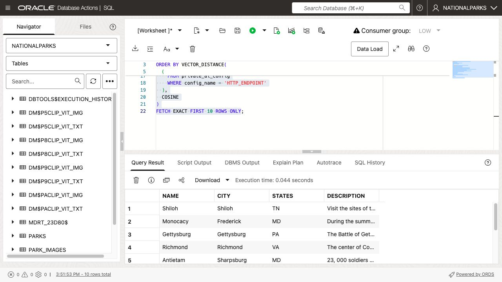
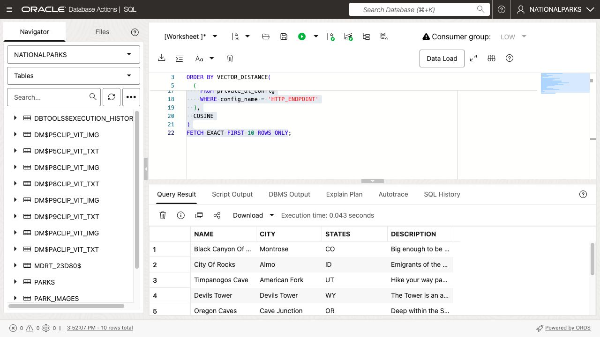
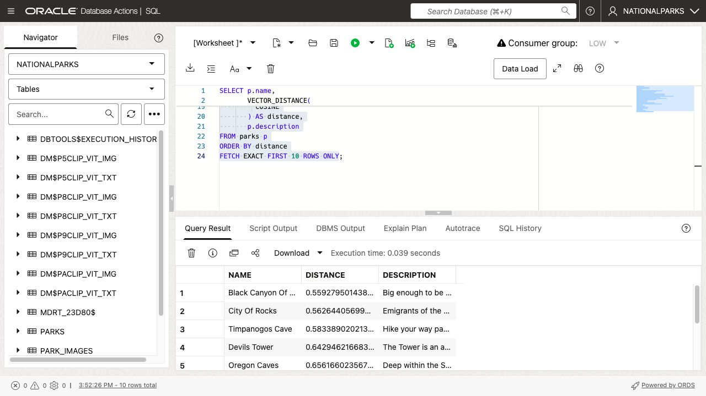
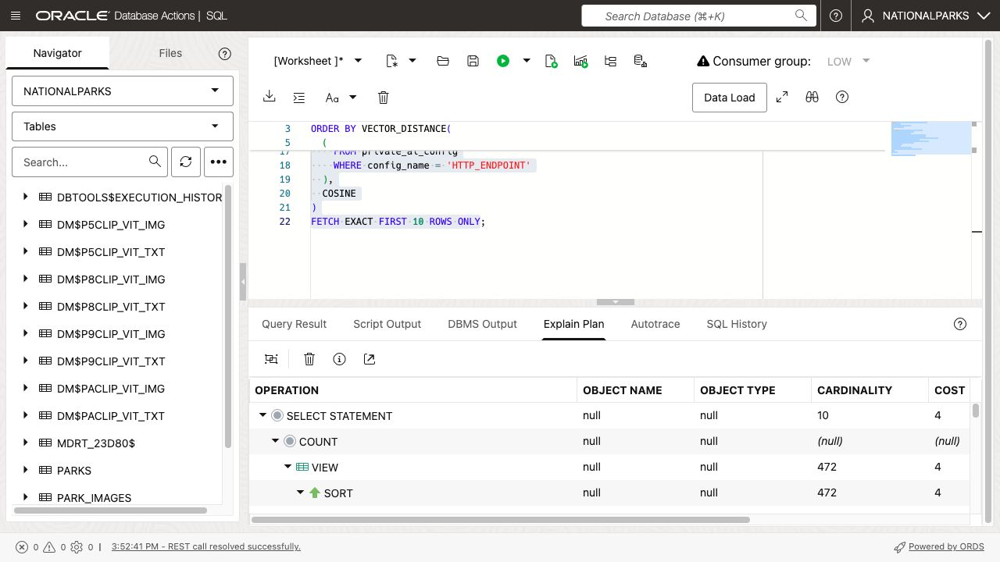

# Exhaustive Similarity Search

## Introduction

This lab uses the text vectors generated by Oracle Private AI Services Container to run exhaustive similarity searches. An exhaustive search compares the query vector with every eligible vector in the table, producing the most accurate result for the selected distance metric.

The query text must also be converted into a vector with the same model used for the stored data. Each search uses an uncorrelated scalar subquery so Oracle generates the query vector once and then compares it with every eligible stored vector.

Estimated Time: 15 minutes

### Objectives

In this lab, you will:

* Generate query vectors inline with the Private AI container
* Run exhaustive similarity searches
* Display vector distances
* Examine an execution plan before creating a vector index

### Prerequisites

This lab assumes you have:

* All previous labs successfully completed
* 472 populated `PARKS.DESC_VECTOR` values
* `PRIVATE_AI_CONFIG` from the previous lab

## Task 1: Search with inline query vectors

The first query searches for parks associated with the American Civil War. The scalar subquery generates one query vector with the same `all-minilm-l12-v2` container model used for `PARKS.DESC_VECTOR`.

1. Search for parks related to the Civil War.

    ```sql
    <copy>
    SELECT p.name, p.city, p.states, p.description
    FROM parks p
    ORDER BY VECTOR_DISTANCE(
      p.desc_vector,
      (
        SELECT DBMS_VECTOR.UTL_TO_EMBEDDING(
                 'Civil War',
                 JSON_OBJECT(
                   'provider' VALUE 'privateai',
                   'credential_name' VALUE NULL,
                   'url' VALUE config_value || '/v1/embeddings',
                   'host' VALUE 'local',
                   'model' VALUE 'all-minilm-l12-v2'
                   RETURNING JSON
                 )
               )
        FROM private_ai_config
        WHERE config_name = 'HTTP_ENDPOINT'
      ),
      COSINE
    )
    FETCH EXACT FIRST 10 ROWS ONLY;
    </copy>
    ```

    Famous Civil War locations should appear near the top. The scalar subquery makes one request to the container, and the `EXACT` keyword requires an exhaustive search.

    

2. Search for parks suited to rock climbing.

    ```sql
    <copy>
    SELECT p.name, p.city, p.states, p.description
    FROM parks p
    ORDER BY VECTOR_DISTANCE(
      p.desc_vector,
      (
        SELECT DBMS_VECTOR.UTL_TO_EMBEDDING(
                 'rock climbing',
                 JSON_OBJECT(
                   'provider' VALUE 'privateai',
                   'credential_name' VALUE NULL,
                   'url' VALUE config_value || '/v1/embeddings',
                   'host' VALUE 'local',
                   'model' VALUE 'all-minilm-l12-v2'
                   RETURNING JSON
                 )
               )
        FROM private_ai_config
        WHERE config_name = 'HTTP_ENDPOINT'
      ),
      COSINE
    )
    FETCH EXACT FIRST 10 ROWS ONLY;
    </copy>
    ```

    The semantic search can identify relevant parks even when the exact phrase does not occur in most descriptions.

    

## Task 2: Display vector distances

The cosine distance is smallest for the closest semantic match. Displaying it makes the ranking visible.

1. Add the distance calculation to the rock-climbing search.

    ```sql
    <copy>
    SELECT p.name,
           VECTOR_DISTANCE(
             p.desc_vector,
             (
               SELECT DBMS_VECTOR.UTL_TO_EMBEDDING(
                        'rock climbing',
                        JSON_OBJECT(
                          'provider' VALUE 'privateai',
                          'credential_name' VALUE NULL,
                          'url' VALUE config_value || '/v1/embeddings',
                          'host' VALUE 'local',
                          'model' VALUE 'all-minilm-l12-v2'
                          RETURNING JSON
                        )
                      )
               FROM private_ai_config
               WHERE config_name = 'HTTP_ENDPOINT'
             ),
             COSINE
           ) AS distance,
           p.description
    FROM parks p
    ORDER BY distance
    FETCH EXACT FIRST 10 ROWS ONLY;
    </copy>
    ```

    The distance increases as the results become less similar to the query vector.

    

## Task 3: Examine the exhaustive execution plan

No vector index exists yet, so the database must evaluate all `PARKS` vectors.

1. Select the following statement and click **Explain Plan**, then choose **Advanced View**.

    ```sql
    <copy>
    SELECT p.name, p.description
    FROM parks p
    ORDER BY VECTOR_DISTANCE(
      p.desc_vector,
      (
        SELECT DBMS_VECTOR.UTL_TO_EMBEDDING(
                 'rock climbing',
                 JSON_OBJECT(
                   'provider' VALUE 'privateai',
                   'credential_name' VALUE NULL,
                   'url' VALUE config_value || '/v1/embeddings',
                   'host' VALUE 'local',
                   'model' VALUE 'all-minilm-l12-v2'
                   RETURNING JSON
                 )
               )
        FROM private_ai_config
        WHERE config_name = 'HTTP_ENDPOINT'
      ),
      COSINE
    )
    FETCH EXACT FIRST 10 ROWS ONLY;
    </copy>
    ```

    The plan includes table access for `PARKS`. The next lab creates an HNSW vector index and changes the search to approximate nearest-neighbor access.

    

## Learn More

* [Oracle AI Vector Search User's Guide](https://docs.oracle.com/en/database/oracle/oracle-database/26/vecse/)
* [Call Private AI Services Container with HTTP in PL/SQL](https://blogs.oracle.com/coretec/how-to-use-the-oracle-private-ai-services-container-with-http-in-pl-sql)

## Acknowledgements

* **Author** - Andy Rivenes, Product Manager, AI Vector Search
* **Contributors** - David Start
* **Last Updated By/Date** - David Start, August 2026
