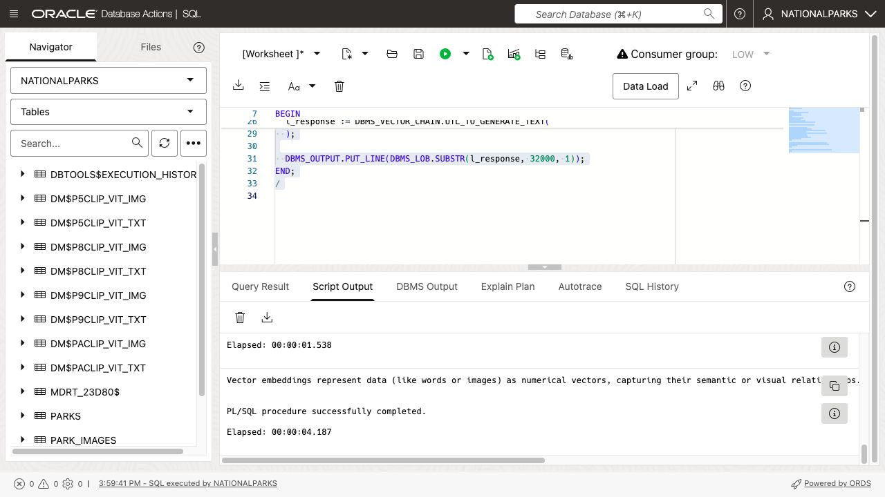
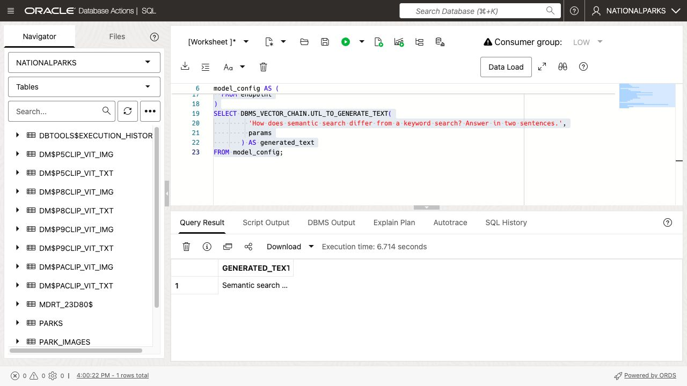

# Generate Text with the Private AI Services Container

## Introduction

Vector embeddings let you compare meaning, but they do not produce a written answer. The Private AI Services Container also hosts a large language model (LLM) that Autonomous AI Database Serverless can call from SQL and PL/SQL. The model runs on the container host, while the prompt and generated response remain part of the database workflow.

In this lab, you will call the container's HTTP chat-completions endpoint with `DBMS_VECTOR_CHAIN.UTL_TO_GENERATE_TEXT`. The workshop environment has already configured the container endpoint, private network path, and database network access control list (ACL).

Estimated Time: 15 minutes

### Objectives

In this lab, you will:

* Verify the container endpoint and database network access
* Generate text from a PL/SQL block
* Generate text from a SQL query
* Recognize timeout and network-access errors

### Prerequisites

This lab assumes you have:

* Completed the Image Search lab
* Access to the `NATIONALPARKS` SQL Worksheet
* A healthy Private AI Services Container endpoint

## Task 1: Verify the Container Connection

The Terraform deployment stores the reservation-specific container URL in `PRIVATE_AI_CONFIG`. Your SQL can read this value instead of embedding a hostname that changes with every workshop environment.

1. Open Database Actions SQL Worksheet and connect as `NATIONALPARKS`.

2. Display the configured HTTP endpoint.

    ```sql
    <copy>
    SELECT config_value AS http_endpoint
    FROM private_ai_config
    WHERE config_name = 'HTTP_ENDPOINT';
    </copy>
    ```

    The result is an HTTP URL with the container host name and port `8080`.

    

3. Verify the outbound HTTP permission granted to the current database user.

    ```sql
    <copy>
    SELECT host,
           lower_port,
           upper_port,
           privilege,
           status,
           private_target
    FROM user_host_aces
    WHERE lower_port = 8080
    ORDER BY host, privilege;
    </copy>
    ```

    The result includes an `HTTP` privilege with status `GRANTED`. `PRIVATE_TARGET` is `YES` because Autonomous AI Database Serverless reaches the container through its private network path.

    

## Task 2: Generate Text from PL/SQL

The container includes the `Ministral-3-3B-Reasoning-2512-Q8_0` model. The following block builds the provider configuration as JSON, sends a prompt to `/v1/chat/completions`, and prints the model's response.

1. Run the PL/SQL block as a script.

    ```sql
    <copy>
    SET SERVEROUTPUT ON

    DECLARE
      l_endpoint VARCHAR2(1000);
      l_params   JSON;
      l_response CLOB;
    BEGIN
      SELECT config_value
      INTO l_endpoint
      FROM private_ai_config
      WHERE config_name = 'HTTP_ENDPOINT';

      UTL_HTTP.SET_TRANSFER_TIMEOUT(120);

      l_params := JSON_OBJECT(
        'provider' VALUE 'privateai',
        'url' VALUE l_endpoint || '/v1/chat/completions',
        'host' VALUE 'local',
        'model' VALUE 'Ministral-3-3B-Reasoning-2512-Q8_0',
        'temperature' VALUE 0,
        'max_tokens' VALUE 256,
        'transfer_timeout' VALUE 120
        RETURNING JSON
      );

      l_response := DBMS_VECTOR_CHAIN.UTL_TO_GENERATE_TEXT(
        'Explain vector embeddings in two concise sentences.',
        l_params
      );

      DBMS_OUTPUT.PUT_LINE(DBMS_LOB.SUBSTR(l_response, 32000, 1));
    END;
    /
    </copy>
    ```

    The response explains vector embeddings. The exact wording can vary even when `temperature` is `0`.

    

    The provider settings identify the container API:

    * `provider` selects the Private AI Services Container integration.
    * `url` points to the container's chat-completions endpoint.
    * `host` is `local`, so this HTTP workshop configuration does not require a database credential.
    * `model` selects the LLM deployed in the container.
    * `max_tokens` limits the generated response.
    * `transfer_timeout` gives the model time to load and complete the response.

## Task 3: Generate Text from SQL

`UTL_TO_GENERATE_TEXT` can also run in a SQL query. The common table expressions below read the endpoint once and build the same provider configuration used by the PL/SQL block.

1. Run the query.

    ```sql
    <copy>
    WITH endpoint AS (
      SELECT config_value
      FROM private_ai_config
      WHERE config_name = 'HTTP_ENDPOINT'
    ),
    model_config AS (
      SELECT JSON_OBJECT(
               'provider' VALUE 'privateai',
               'url' VALUE config_value || '/v1/chat/completions',
               'host' VALUE 'local',
               'model' VALUE 'Ministral-3-3B-Reasoning-2512-Q8_0',
               'temperature' VALUE 0,
               'max_tokens' VALUE 256,
               'transfer_timeout' VALUE 120
               RETURNING JSON
             ) AS params
      FROM endpoint
    )
    SELECT DBMS_VECTOR_CHAIN.UTL_TO_GENERATE_TEXT(
             'How does semantic search differ from a keyword search? Answer in two sentences.',
             params
           ) AS generated_text
    FROM model_config;
    </copy>
    ```

    The result contains a generated comparison of semantic and keyword search. This SQL form can be incorporated into a query, stored procedure, or application workflow.

    

2. If a generation call fails, use the error to identify the layer that needs attention.

    * `ORA-29273` or `ORA-24247` indicates that the host, port, route, or database ACL needs review.
    * `ORA-29276` indicates a transfer timeout. The first request can take longer while the model loads. Retain `transfer_timeout` at `120` seconds or reduce `max_tokens` for a shorter response.
    * An HTTP 400 response usually indicates an unsupported model name or request shape.

You have now called the same container from both PL/SQL and SQL. The later RAG lab combines this text-generation call with vector retrieval so the model can answer from database records.

## Learn More

* [Use the Private AI Services Container LLM Service with HTTP in PL/SQL](https://blogs.oracle.com/coretec/how-to-use-the-oracle-private-ai-services-container-llm-service-with-http-in-pl-sql)
* [DBMS_VECTOR_CHAIN](https://docs.oracle.com/en/database/oracle/oracle-database/26/arpls/dbms_vector_chain1.html)
* [Oracle Private AI Services Container User's Guide](https://docs.oracle.com/en/database/oracle/oracle-database/26/prvai/)

## Acknowledgements

* **Author** - Andy Rivenes, Product Manager, AI Vector Search
* **Contributors** - David Start
* **Last Updated By/Date** - David Start, August 2026
