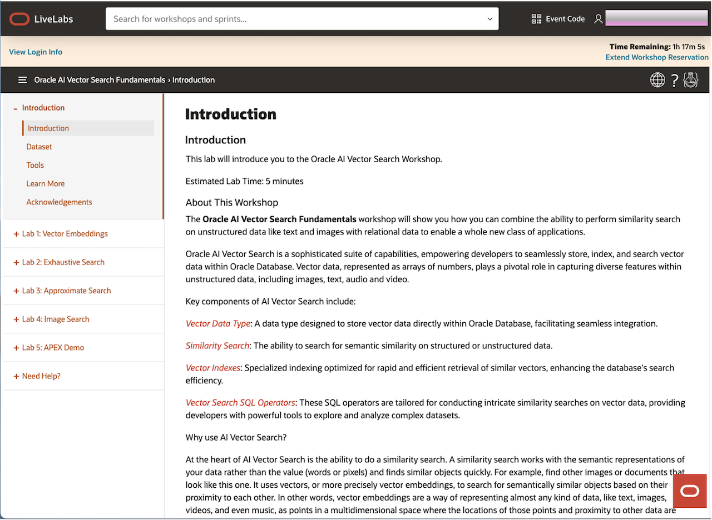
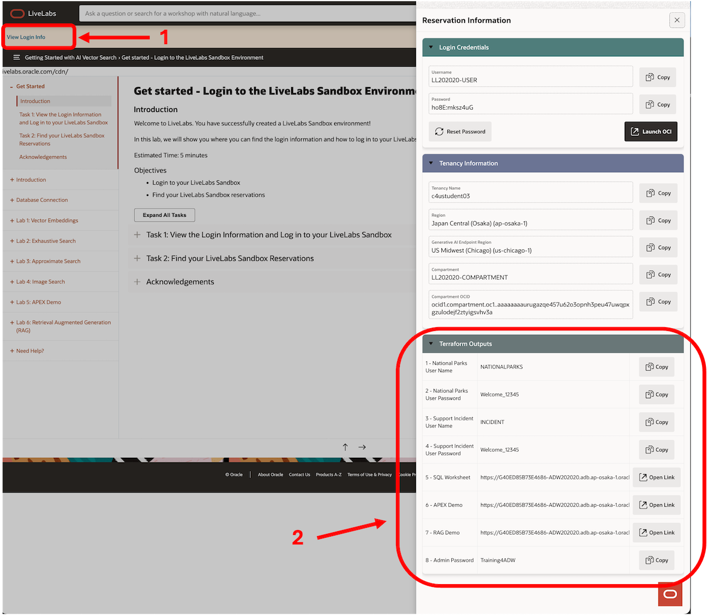
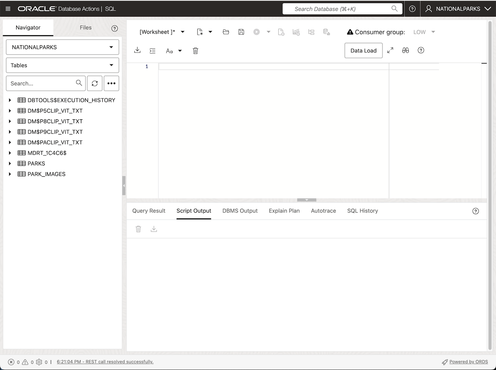

# Database Connection

## Introduction

This lab connects you to the Autonomous AI Database Serverless instance used by the workshop. You will run the SQL and PL/SQL exercises in Database Actions SQL Worksheet. The database calls Private AI Services Container through the workshop network, so you do not connect to the container directly.

Watch the video below for a quick walk-through of the similarity search on images lab:

[Database Connection lab video](https://videohub.oracle.com/media/Vector-Search-Database-Connection-Lab/1_86zguvif)

Estimated Time: 5 minutes

### Objectives

In this lab, you will:

* Connect to the NATIONALPARKS user

### Prerequisites

This lab assumes you have:

* An Oracle account
* A running workshop reservation

## Task 1: Connect to Autonomous AI Database Serverless

The workshop uses Autonomous AI Database Serverless 26ai with AI Vector Search. The Database Actions URL is displayed with the reservation login information.

See the image below for an example:

If you click on the "View Login Info" button in the upper left corner of the Introduction page a pop up page will appear on the right. You can click on the SQL Worksheet link and sign in with the username "NATIONALPARKS" and the password "Welcome_12345".

See the image below for an example:

After signing in you should see a browser window like the following:

## Learn More

* [Oracle AI Vector Search Users Guide](https://docs.oracle.com/en/database/oracle/oracle-database/26/vecse/index.html)
* [Oracle Private AI Services Container User's Guide](https://docs.oracle.com/en/database/oracle/oracle-database/26/prvai/)
* [Oracle Database 26ai Release Notes](https://docs.oracle.com/en/database/oracle/oracle-database/26/rnrdm/index.html)
* [Oracle Documentation](http://docs.oracle.com)

## Acknowledgements
* **Author** - Andy Rivenes, Product Manager, AI Vector Search
* **Contributors** - David Start
* **Last Updated By/Date** - David Start, August 2026
